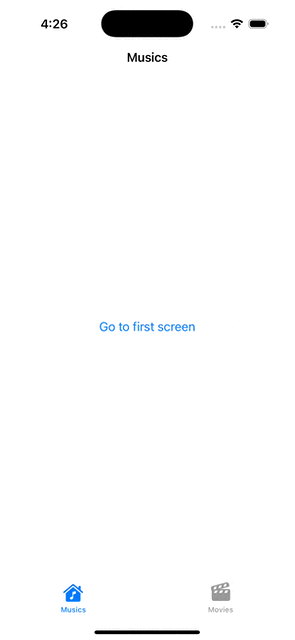

# **SwiftUI Generic Router**

## About the Project

This project demonstrates how to create a **Generic Router** for reusable navigation in **SwiftUI** applications, with integration for **TabView** navigation. The solution allows you to manage different modules and navigate between views seamlessly using a clean and scalable approach.

The goal is to implement modular and reusable navigation that can be applied across various parts of your app, avoiding repetitive code and making your navigation structure more flexible.

## Features
- **Reusable Navigation**: Easily navigate between different views in SwiftUI.
- **Modular Router**: Can be used for different modules within the app.
- **TabView Integration**: Supports navigation within a TabView structure.
- **Customizable**: Works with any module or screen, enabling flexibility across your app.

## Screenshots & GIF
Here’s a quick look at the app in action!

## Documentation
For detailed steps and code breakdown, you can refer to the **PDF Documentation**:
[View the PDF Documentation](GenericRouter.pdf)

## Video Tutorial
For a visual guide, check out the [YouTube video]([insert-youtube-link](https://youtu.be/XJA1Dom-W48)) that explains how to use and implement the Generic Router in SwiftUI.
